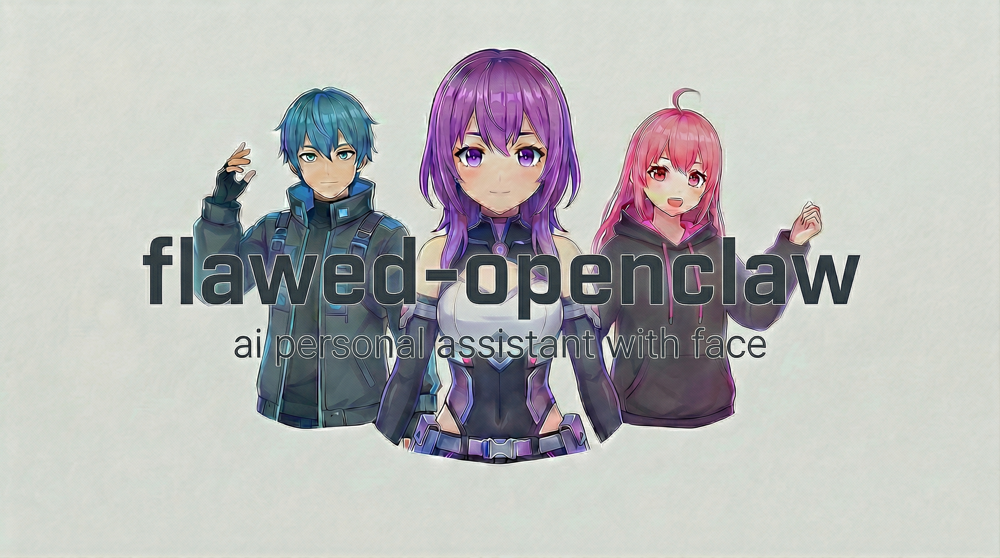

<p align="center">
  
</p>

<h3 align="center">a VRM avatar that reacts to your AI assistant in real-time</h3>

<p align="center">
  <a href="LICENSE"></a>
  <a href="https://nodejs.org/">= 22"></a>
  <a href="https://www.electronjs.org/"></a>
  <a href="https://threejs.org/"></a>
  <a href="https://www.npmjs.com/package/openclaw-avatar-overlay"></a>
</p>

<p align="center">
  <a href="#what-is-this">About</a> •
  <a href="#features">Features</a> •
  <a href="#quick-start">Quick Start</a> •
  <a href="#configuration">Configuration</a> •
  <a href="#architecture">Architecture</a> •
  <a href="#tech-stack">Tech Stack</a>
</p>

---

## What is this?

**Avatar Overlay** is a transparent Electron window that renders a VRM avatar using Three.js. It connects to your [OpenClaw](https://github.com/openclaw/openclaw) assistant over WebSocket and translates agent lifecycle events into animations, expressions, lip sync, and speech — in real-time.

This repo is a fork of [openclaw/openclaw](https://github.com/openclaw/openclaw). All upstream features (channels, gateway, skills, voice, canvas) work as documented. The avatar overlay is the primary addition.

---

## Features

### Animation System

| Feature | Details |
|---------|---------|
| **4-state FSM** | idle, thinking, speaking, working — driven by agent lifecycle events |
| **Mixamo FBX clips** | Crossfade transitions (0.5s phase change, 0.3s variety rotation), variety rotation per state |
| **Procedural fallback** | Breathing (1.8 Hz), head sway (0.5/0.3 Hz X/Y), speaking nod, working tilt |
| **Blinking** | Procedural blink every 2–6s (60ms close, 100ms open) |

### Expressions

| Feature | Details |
|---------|---------|
| **6 compound-blend expressions** | happy (happy + aa), angry (angry + ee), surprised (surprised + aa), sad, relaxed, neutral |
| **Cubic easing** | Per-emotion durations — surprised 0.1s, angry 0.25s, happy 0.3s, sad 0.4s, relaxed 0.5s |
| **Hover overlays** | 4-state awareness FSM: unaware → noticing (surprised 0.3) → attentive (happy 0.4) → curious (surprised 0.5) |

### Lip Sync

| Feature | Details |
|---------|---------|
| **wLipSync (real-time)** | MFCC audio analysis → winner/runner viseme selection → exponential smoothing |
| **Phoneme-mapped** | Kokoro TTS word boundaries drive a viseme frame queue |
| **Text-driven fallback** | Character-to-viseme mapping at 50ms/char |
| **Max-merge blending** | Lip sync and expressions coexist via `Math.max()` — no collision |

### Eye System

| Feature | Details |
|---------|---------|
| **Cursor-tracking gaze** | Eye (±20° yaw, ±15° pitch, fast) + head (±25° yaw, ±15° pitch, slow) with 50px deadzone |
| **Saccades** | Weighted probability intervals (800ms–4.4s), 3-phase cycle (move → hold → return), ±5° yaw / ±3.75° pitch |
| **Hover-aware multiplier** | Gaze intensity scales with awareness state (1.0× → 1.2×) |
| **VRM 0.x / 1.0** | Automatic pitch inversion for 0.x models |

### Text-to-Speech

| Feature | Details |
|---------|---------|
| **Kokoro** | Offline neural TTS via kokoro-js — 11 voices (5 American female, 2 American male, 2 British female, 2 British male) |
| **Web Speech API** | System voices, zero-download fallback |
| **Runtime switching** | Change engine and voice without restart; auto-fallback if Kokoro init fails |

### Rendering

| Feature | Details |
|---------|---------|
| **IBL shader injection** | SH3 coefficients computed from scene lights, injected into MToon vertex/fragment shaders |
| **Pixel-sampled click-through** | Transparent regions pass input to windows below |
| **Spring bone physics** | Hair, clothes, accessories via `@pixiv/three-vrm-springbone` |
| **VRM 0.x and 1.0** | Full support via `@pixiv/three-vrm 3.x` |

### Window

| Feature | Details |
|---------|---------|
| **Native drag** | Main-process cursor polling at 16ms — no `-webkit-app-region` hacks |
| **Display-aware bounds** | Clamps to `workArea` on move and display hotplug |
| **Scroll-wheel zoom** | 0.5×–6.0× range, 0.2× step, presets: head (0.6×), upper body (1.5×), full body (4.0×) |
| **Opacity control** | 0.3–1.0 range with idle fade timeout |
| **Persistence** | Window position, zoom, opacity, and settings saved between sessions |

---

## State Visualization

The avatar maps agent lifecycle events to visual states:

```
lifecycle.start  →  thinking   →  surprised expression, thinking animation, 2.5× head sway
assistant.text   →  speaking   →  happy expression, lip sync active, speaking nod
tool.*           →  working    →  relaxed expression, working animation, head tilt
lifecycle.end    →  idle       →  neutral expression, idle animation, base sway

                    hover awareness (layered on top of any state)
cursor near      →  noticing   →  surprised 0.3, gaze 1.1×
cursor stays     →  attentive  →  happy 0.4, gaze 1.2×
cursor lingers   →  curious    →  surprised 0.5, gaze 1.15×
```

---

## Quick Start

### Plugin Install (existing OpenClaw users)

```bash
openclaw plugins install openclaw-avatar-overlay
openclaw restart
```

The avatar spawns when the gateway starts.

### Full Clone + Build

**Prerequisites:** Node >= 22, pnpm, Git

```bash
git clone https://github.com/RyuuTheChosen/flawed-openclaw.git
cd flawed-openclaw
pnpm install
pnpm build
pnpm openclaw onboard
```

### Commands

| Command | Action |
|---------|--------|
| `/avatar_show` | Show the overlay |
| `/avatar_hide` | Hide the overlay |

### Development

```bash
cd packages/avatar-overlay
pnpm dev    # Build + launch standalone
```

---

## Configuration

Plugin config lives in your OpenClaw config file:

```yaml
# ~/.openclaw/config
plugins:
  entries:
    avatar-overlay:
      config:
        autoStart: true                        # spawn on gateway start (default: true)
        vrmPath: "/path/to/your/model.vrm"     # default VRM model
        gatewayUrl: "ws://127.0.0.1:18789"     # gateway WebSocket (default)
        agents:                                 # per-agent VRM overrides
          my-coding-agent:
            vrmPath: "/path/to/other/model.vrm"
```

| Key | Type | Default | Description |
|-----|------|---------|-------------|
| `autoStart` | boolean | `true` | Spawn overlay when gateway starts |
| `vrmPath` | string | built-in | Path to default VRM model |
| `gatewayUrl` | string | `ws://127.0.0.1:18789` | Gateway WebSocket URL |
| `agents` | object | — | Per-agent VRM path overrides |

---

## Architecture

```
┌──────────────────────────────────────────────────────────────────┐
│                        Avatar Overlay                             │
├──────────────────────────────────────────────────────────────────┤
│                                                                   │
│  Main Process                    Renderer Process                 │
│  ┌────────────────────┐          ┌──────────────────────────┐     │
│  │ Gateway Client (WS) │─events─►│ State Machine (FSM)      │     │
│  │ Window Manager      │         │   ├─ Animator             │     │
│  │ Native Drag         │         │   │   ├─ FBX Clips        │     │
│  │ Display Bounds      │         │   │   ├─ Procedural       │     │
│  │ Click-Through       │         │   │   └─ Blinking         │     │
│  │ Zoom / Opacity      │         │   ├─ Expressions          │     │
│  │ Persistence         │         │   │   └─ Cubic Easing     │     │
│  └────────────────────┘         │   ├─ Lip Sync             │     │
│                                  │   │   ├─ wLipSync (MFCC)  │     │
│                                  │   │   ├─ Phoneme Queue    │     │
│                                  │   │   └─ Text Fallback    │     │
│                                  │   ├─ Eye Gaze + Saccades  │     │
│                                  │   ├─ Hover Awareness      │     │
│                                  │   └─ TTS (Kokoro / Web)   │     │
│                                  │                            │     │
│                                  │ Three.js Scene             │     │
│                                  │   ├─ VRM Model + Bones     │     │
│                                  │   ├─ IBL Shader Injection  │     │
│                                  │   └─ Spring Bone Physics   │     │
│                                  └──────────────────────────┘     │
│                                                                   │
│  Animation Loop (each frame):                                     │
│  clips/procedural → blink → saccades → eye gaze → hover          │
│  → expressions → lip sync → spring bones                          │
│                                                                   │
└──────────────────────────────────────────────────────────────────┘
              ▲
              │ WebSocket
              ▼
     ┌─────────────────┐
     │  OpenClaw Gateway │
     │  (agent events)   │
     └─────────────────┘
```

---

## Tech Stack

### Avatar Overlay

| Component | Technology | Version |
|-----------|------------|---------|
| Runtime | Electron | ~33.0 |
| 3D Engine | Three.js | ~0.170 |
| VRM | @pixiv/three-vrm | ~3.3 |
| Spring Bones | @pixiv/three-vrm-springbone | ~3.3 |
| TTS | kokoro-js | ^1.2 |
| Lip Sync | wLipSync | ^1.3 |
| Bundler | Rolldown | 1.0.0-rc.2 |

### Core Platform

| Component | Technology |
|-----------|------------|
| Runtime | Node.js >= 22 |
| Language | TypeScript 5.9 |
| Package Manager | pnpm 10 |
| Linter | oxlint |
| Formatter | oxfmt |
| Test | Vitest |

---

## Upstream

Built on [**openclaw/openclaw**](https://github.com/openclaw/openclaw). All upstream features work as documented.

- **Upstream:** [github.com/openclaw/openclaw](https://github.com/openclaw/openclaw)
- **Docs:** [docs.openclaw.ai](https://docs.openclaw.ai)

---

## Fork Activity

<a href="https://star-history.com/#RyuuTheChosen/flawed-openclaw&Date">
  <picture>
    <source media="(prefers-color-scheme: dark)" srcset="https://api.star-history.com/svg?repos=RyuuTheChosen/flawed-openclaw&type=Date&theme=dark" />
    <source media="(prefers-color-scheme: light)" srcset="https://api.star-history.com/svg?repos=RyuuTheChosen/flawed-openclaw&type=Date" />
    
  </picture>
</a>

---

## License

MIT — same as upstream. See [LICENSE](LICENSE).
